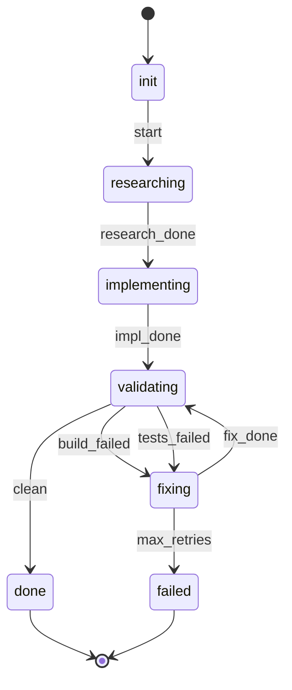

```mermaid
stateDiagram-v2
    [*] --> init
    init --> researching : start
    researching --> implementing : research_done
    implementing --> validating : impl_done
    validating --> fixing : build_failed
    validating --> fixing : tests_failed
    validating --> done : clean
    fixing --> validating : fix_done
    fixing --> failed : max_retries
    done --> [*]
    failed --> [*]
```
