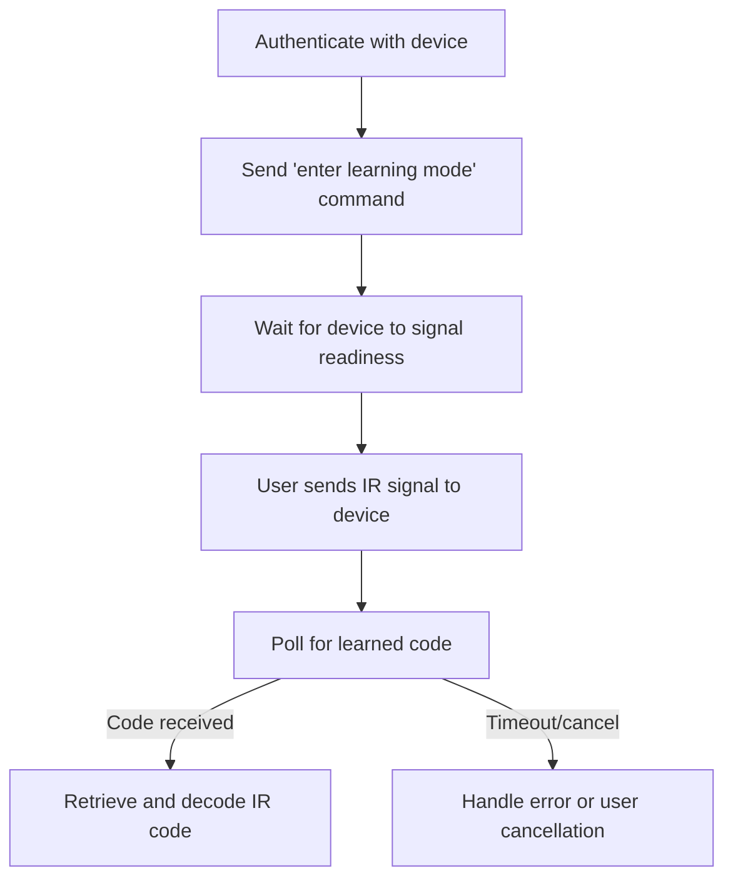

# Broadlink RM4 Mini IR Learning Protocol

Summary: Documents the IR learning sequence for the RM4 Mini — enter learning mode, poll for the captured IR code, then decode and store it.

This document describes the IR learning protocol for the Broadlink RM4 Mini, as implemented in AdaptiveRemote. It is distilled from the [mjg59/python-broadlink](https://github.com/mjg59/python-broadlink) Python project and references the C# implementation in `AdaptiveRemote.Services.Broadlink.DeviceConnection`.

## Overview
- **Device:** Broadlink RM4 Mini
- **Transport:** UDP (port 80)
- **Authentication:** Required before sending commands (see `DeviceConnection.AuthenticateAsync`)
- **Learning Sequence:** Asynchronous, with polling and timeout

## High-Level Sequence Diagram

## Protocol Steps

1. **Authenticate**
   - Use the authentication command (0x65) to obtain a session key and device ID.
   - See: `DeviceConnection.AuthenticateAsync`

2. **Enter Learning Mode**
   - Send a 'start learning' command to the device (typically command code 0x6A with a specific payload for learning mode).
   - Device responds to indicate readiness.

3. **Wait for Readiness**
   - The device may take a short time to enter learning mode. Wait for a response or poll for readiness.

4. **User Sends IR Signal**
   - The user points their remote at the RM4 Mini and presses the button to be learned.

5. **Poll for Learned Code**
   - Periodically send a 'check for learned code' command (as in the Python project: every 1-2 seconds).
   - If the device has received an IR code, it responds with the code data.
   - If not, continue polling until a timeout (e.g., 20-30 seconds) or user cancels.

6. **Retrieve and Decode**
   - When the device responds with the learned code, decode the payload and store it (Base64-encoded for storage).

7. **Error Handling**
   - If the device does not respond, returns an error, or times out, handle appropriately (show error to user, allow retry or cancel).
   - See: `DeviceConnection.CheckError`

## Notes
- The polling pattern for IR learning is different from simple command sending. Refer to the [mjg59/python-broadlink Python implementation](https://github.com/mjg59/python-broadlink/blob/master/broadlink/remote.py) for details.
- The C# implementation may need to be extended to support polling for learned codes as described above.
- For packet structure and encryption, see the C# code in `DeviceConnection` and related payload classes.

## References
- [mjg59/python-broadlink Python project](https://github.com/mjg59/python-broadlink)
- `AdaptiveRemote.Services.Broadlink.DeviceConnection` (C#)

---
This document is intended as a protocol reference. For implementation details, see the source code.